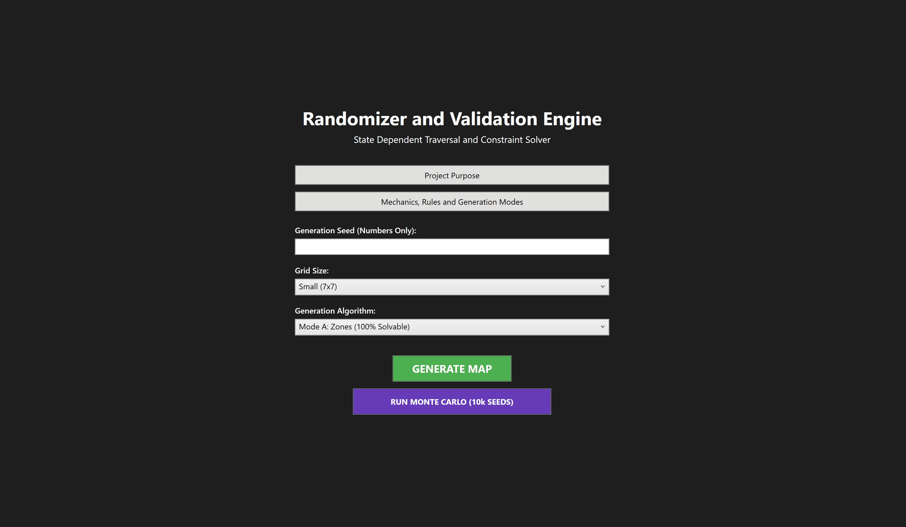

# State Dependant Room Navigation, Generation and Validation

## Project Purpose
The purpose of this project was to solve and explore the architectural challenge of state-dependent procedural generation. Inspired by the routing complexities of video game randomizers that require strict logic for glitchless playthroughs (such as *Ocarina of Time*), this project models mutating topological graphs where inventory changes dynamically alter traversal rules. 

The system was engineered to solve the Traveling Salesperson Problem within these evolving constraints, utilizing state memoization and heuristic pruning to bypass combinatorial explosions. The result is an engine that constructs highly constrained logic mazes and simulates parallel timelines to calculate perfect completion routes.

---

## Rules of the Simulation

The application simulates a 2D graph environment where the player must navigate from the center of the map to a designated Finish Room located on the perimeter. 

Rooms are traversed by interacting with doorways in the cardinal directions. When a door is locked, it requires a specific key to open, introducing strict progression logic into the graph.

**The Key & Lock System:**
* **Strong Keys (Red, Blue, Green, Yellow):** Persistent items. Once acquired, they can open an unlimited number of doors matching their color, permanently opening new branches of the graph.
* **Consumables (Silver Key, Lockpick):** Single-use items that mutate the global state of the graph upon use. Silver keys open specific silver locks, while the Lockpick acts as a universal wildcard for any door. 

---

## Procedural Generation Modes

The engine features three distinct map generation algorithms, each designed to test different aspects of graph logic and game design.

* **Mode A: Zones**
  This mode generates structured, highly designed maps that are always beatable. It scatters one of each Strong Key and creates dedicated "zones" on the map where locks of that corresponding key are prominent. This creates a challenging early-zone experience that systematically opens up into a free-roaming exploration phase. This generation allows for freedom of choice without strict, linear pathways.

* **Mode B: Random Scramble With Validation**
  A highly controlled randomization engine. This mode allows only one of each Strong Key and applies a strictly tuned consumable-to-lock ratio. It randomly scatters items and locks, and then immediately runs a background validation check. If the map is unbeatable, it scraps the layout and tries again. This guarantees that every presented map—while potentially highly restrictive or challenging—is 100% mathematically beatable and can be perfectly replicated using its Seed.

* **Mode C: Chaos**
  A pure sandbox mode with minimal rules. Aside from placing the Finish Room on the border, items and locks are scattered with total entropy. Maps generated in this mode are often unbeatable. This mode exists to explicitly demonstrate why strict generation rules are necessary for game design, and it provides highly complex, messy graphs to stress-test the Analytics Engine's failure-recognition capabilities.

---

## Under the Hood: The Analytics Engine

To validate maps and calculate perfect routes, the application utilizes a custom-built pathfinding engine to navigate the dynamic-state graph. 

* **Combinatorial Optimization:** Solves a mutating-state variation of the Traveling Salesperson Problem (TSP). As the simulated player uses consumable keys, the traversal rules of the graph change, requiring dynamic inventory tracking across thousands of parallel timelines.
* **State Memoization:** Prevents exponential timeline proliferation (2^N complexity) by snapshotting universe states. The engine uses a custom LINQ-sorted hash function (`R:X,Y|I:inv|U:unlocked`) to immediately cull duplicate timelines that reach identical states via slower routes.
* **Heuristic Pruning:** Tracks continuous idle traversal cycles. If a simulated timeline wanders through empty rooms without modifying its global inventory state for too long, the branch is culled, safely compressing 30-second computation deadlocks into sub-second operations.
* **Multi-Tiered Routing:** Deploys Breadth-First Search (BFS) for rapid topological connectivity checks, a modified Bucket Priority Queue for calculating Least Steps/Locks, and a Greedy Best-First Search for 100% map completion routing.

## System Architecture & UI

* **Asynchronous Execution:** Heavy pathfinding analytics, Monte Carlo validation loops, and map generation are strictly isolated from the WPF Main Thread via the Task Parallel Library (`Task.Run`), ensuring the UI remains highly responsive.
* **Safe-State Synchronization:** Features deep `CancellationToken` integration to allow instant user aborts of massive computations. The UI programmatically disables interaction gates during background execution to prevent data corruption.
* **Auditing & Telemetry:** Pathfinding algorithms natively reconstruct raw mathematical decisions into human-readable chronological string traces (e.g., `Moved East to [1,2]. Unlocked with Red Key. Picked up Lockpick.`), permitting instantaneous manual validation of the engine's logic.

---

## Installation & Execution

1. Navigate to the **Releases** tab on this repository.
2. Download the most recent `.zip` file.
3. Extract the workspace and execute the `.exe` file. No installation or dependencies are required.

## License
This project is open-source and distributed under the terms of the [MIT License](LICENSE).
